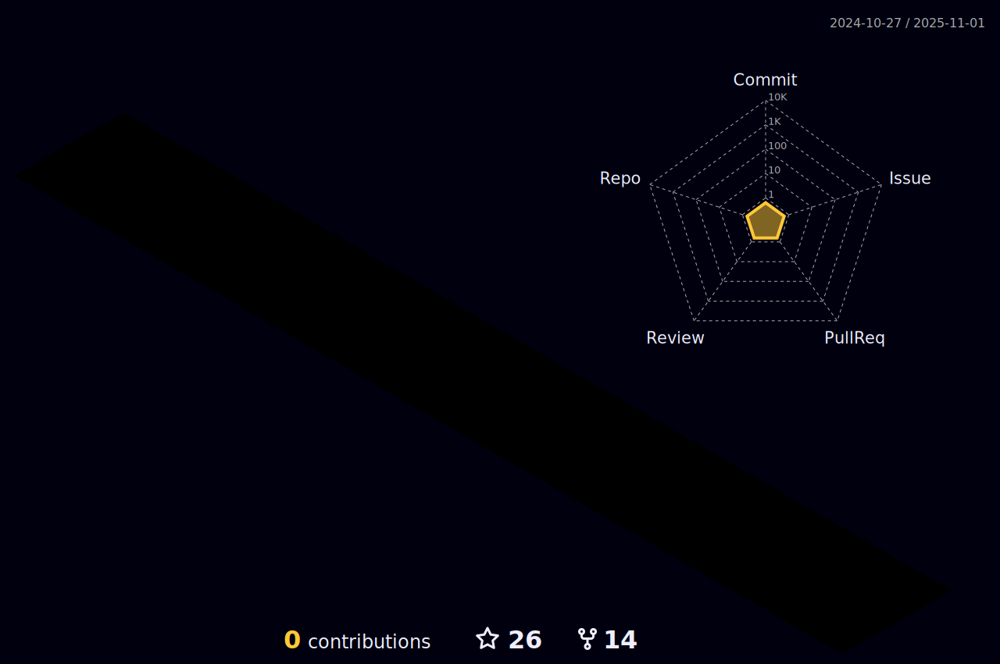

## Hi, there! 👋✨

Experienced blockchain engineer who now specialize in Smart contract development and Web3 with extensive knowledge of Solidity, Go and Rust on EVM chains(Ethereum, Binance etc) and other ecosystems like Solana, Near and Terra. 
Huge crypto fan especially DeFi. Very Flexible with working environment and love to talk to other team members and very eager to learn new technology.

---

### What's up now?

---

